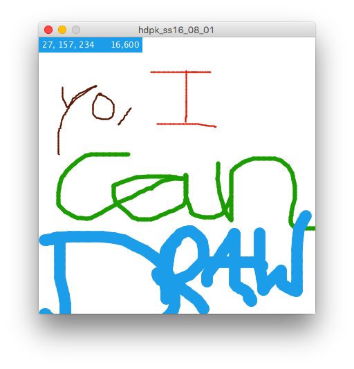
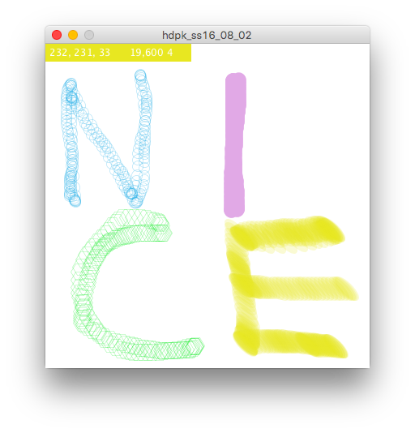
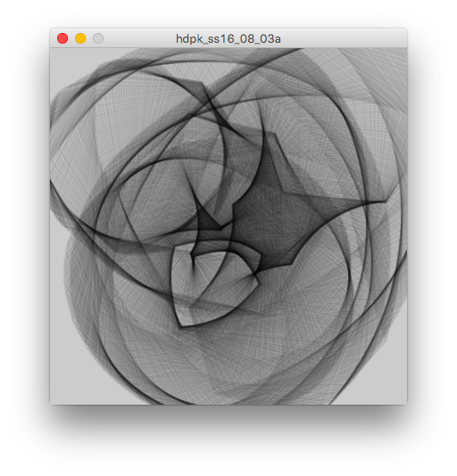
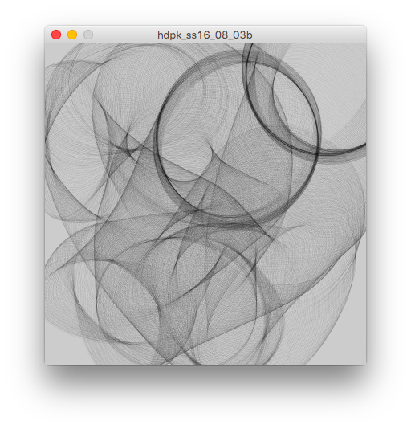
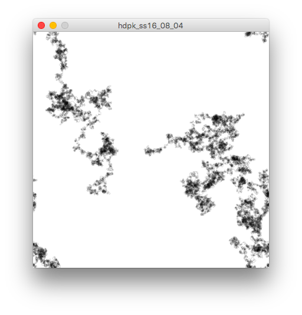

# From Mouse to Agent

One last time, we'll focus about drawing on the screen today. We'll start with something you already know: Using your mouse to draw on the screen. But we'll take this further by introducing events and adding controls to change color, pen size and shape. To do the latter, we will also get to know a new way to draw custom shapes.

## 1 Drawing with lines
**New Stuff:** mouseDragged(), keyReleased(), pmouseX, pMouseY, saveFrame()  

* Draw a line when the mouse is clicked.
* Make the color changeable with the keyboard using the 'r', 'g', 'b' keys. 
* Make the line-thickness adjustable with the keyboard using the 't' key or the mouse scoll wheel
* Show the color and line thickness in a menu top left
* Save image to file

## 2 Drawing with other shapes
**New Stuff:** beginShape(), endShape(), vertex(), bezier()

* Add the functionality to change the brush from line to circle
* Add a custom-shaped brush in form of a hexagon
* Add a bezier curve as a brush

## 3 Animated Brush

* New drawing tool that draws a shape that drifts towards the mouse and morphs
* Once in form of a hexagon, once in form of a morphing bezier

## 4 Agent (aka "look ma, no hands!")
* An autonomous agent draws small circles and changes it direction of movement each time. 
* Tasks:
	* use [noise()](https://processing.org/reference/noise_.html) instead of random() to define the movement
	* make the agent react to its own trail. use the [get() function](https://processing.org/reference/get_.html) for this.
	* put the agent into a class and start new agents with the click of a mouse (start point should be the mouse positon)

