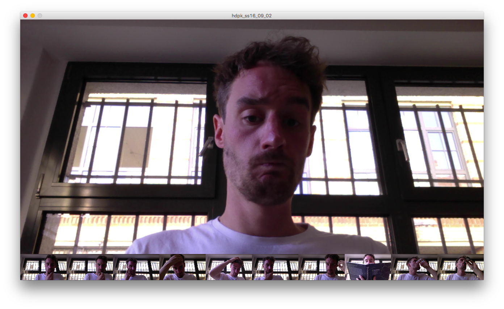

# Camera

## 1 Getting and image from the camera
**New Stuff:** Capture
* Display the live video from the computer's internal camera

## 2 Display the last ten images and add filters!

## 3 GIFs!
**New Stuff:** millis()
Take ten images and display them after each other in a loop!

## 4 Looking at Pixels

## 5 Finding the brightest point

more: [http://www.creativecoding.org/lesson/topics/video/video-in-processing](http://www.creativecoding.org/lesson/topics/video/video-in-processing)